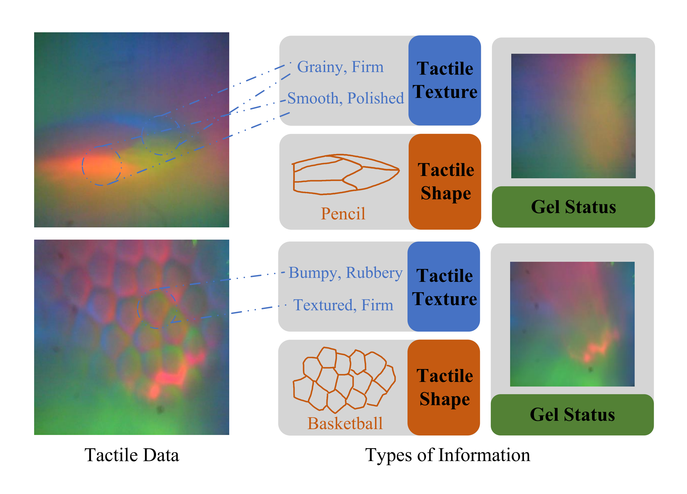
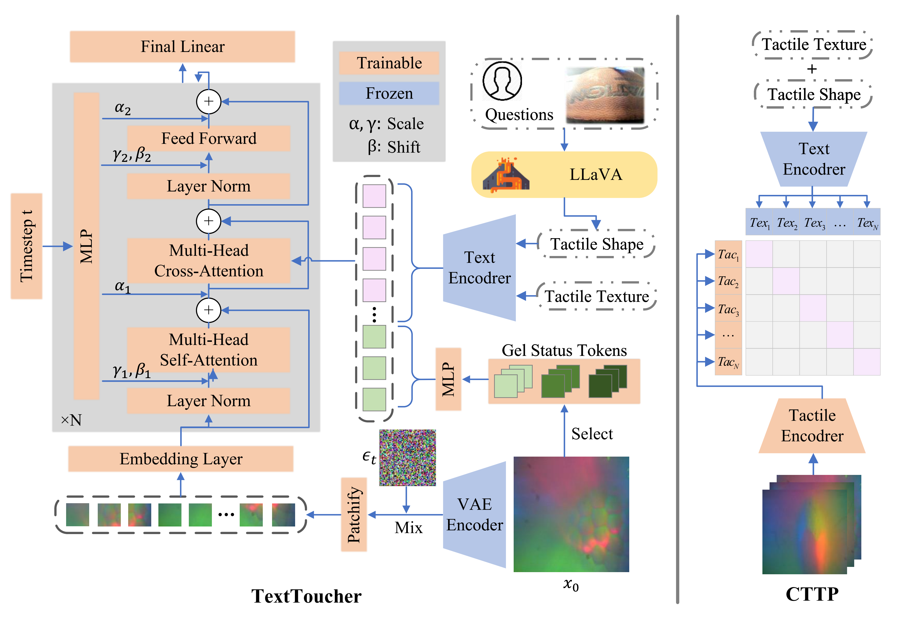
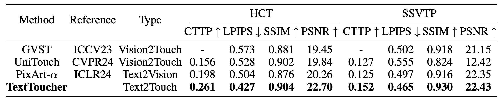

# TextToucher: Fine-Grained Text-to-Touch Generation
[](https://arxiv.org/abs/2409.05427)


---

## Introduction
Tactile sensation plays a crucial role in the development of multi-modal large models and embodied intelligence. To collect tactile data with minimal cost as possible, a series of studies have attempted to generate tactile images by vision-to-touch image translation. However, compared to text modality, visual modality-driven tactile generation cannot accurately depict human tactile sensation. In this work, we analyze the characteristics of tactile images in detail from two granularities: object-level (tactile texture, tactile shape), and sensor-level (gel status). We model these granularities of information through text descriptions and propose a fine-grained Text-to-Touch generation method (TextToucher) to generate high-quality tactile samples. Specifically, we introduce a multimodal large language model to build the text sentences about object-level tactile information and employ a set of learnable text prompts to represent the sensor-level tactile information. To better guide the tactile generation process with the built text information, we fuse the dual grains of text information and explore various dual-grain text conditioning methods within the diffusion transformer architecture. Furthermore, we propose a Contrastive Text-Touch Pre-training (CTTP) metric to precisely evaluate the quality of text-driven generated tactile data. Extensive experiments demonstrate the superiority of our TextToucher method.

## Dual-Grain Text Conditions


## Method


## Results



## Requirements
### Environment
1. [torch 2.1.2](https://github.com/pytorch/pytorch)
2. [torchvision 0.16.2](https://github.com/pytorch/vision)
3. [timm 0.6.13](https://github.com/huggingface/pytorch-image-models)
4. cuda 12.2

You can use the following command to install the environment.
```bash
conda create -n TextToucher python=3.10
conda activate TextToucher
pip install -r requirements.txt
```

### Datasets
We compare TextToucher and other touch generation methods on the [HCT](https://tactile-vlm.github.io/) dataset and [SSVTP](https://sites.google.com/berkeley.edu/ssvtp) dataset.

### Pre-training Models
We utilize [LLaVA-v1.6-34b](https://huggingface.co/liuhaotian/llava-v1.6-34b) to annotate tactile texture and shape descriptions in tactile images. We conduct the text-to-touch generation task on the pre-trained [PixArt-$\alpha$](https://huggingface.co/PixArt-alpha/PixArt-alpha/tree/main). Besides, [T5-XXL](https://huggingface.co/PixArt-alpha/PixArt-alpha/tree/main) are employed to encode text descriptions. You can download checkpoints in the ``pretrained_model`` folder

## Preprocessing
To avoid repeated feature extraction， we provide scripts in preprocessing folder to extract features about text descriptions and tactile images. And you can organize the dataset `XXX_caption.json` as follows:
```json
{
    "tactile_img": "data3/0-1705099687.5914/tactile/117-0.02232813835144043.jpg",
    "tactile_feat": "data3/0-1705099687.5914/touch_feature/117-0.02232813835144043.npy",
    "txt_feat": "data3/0-1705099687.5914/prompt_caption/117-0.02232813835144043.npz",
    "prompt": "the touch of blanket is grainy, textured, coarse, rough."
}
```

## Training
We provide the config file in the ``config`` folder for both HCT and SSVTP dataset. You should modify the `data_root` and `json_file` in the config file.
```bash
CUDA_VISIBLE_DEVICES=0,1,2,3 torchrun --nnodes=1 --nproc_per_node=4 --master-port=11113 \
    tools/train.py --config configs/TextToucher_img512_HCT.py
```

## Synthesis
```bash
python ./tools/synthesis.py  \
--model_path '/TextToucher_path/results/hct/checkpoints/model.pth' \
--vae_path '/TextToucher_path//pretrained_model/sd-vae-ft-ema' \
--save_dir '/TextToucher_path/results/hct/samples/dpm50_seed43_cfg4.5' \
--device 'cuda:0' --vae_device 'cuda:0' \
--eval_prompts 'hct_eval/prompt_embed.ckpt' \
--gt_dir 'hct_eval/tactile/' \
--sampling_algo 'dpm-solver' \
--bg_idx  'hct_eval/bg_idx.ckpt' \ # the gel status idx
--batch_size 25 \
--config '/TextToucher_path/configs/TextToucher_img512_HCT.py' \
--seed 43  --cfg 4.5  --steps 50 
```

## Evaluation
```bash
# LPIPS, SSIM, PSNR
python ./metrics/metric.py --device cuda:0 --paths "gt_dir" "generated_dir" --batch_size 25 
```

You can train a tactile encoder using contrastive loss as follows:
```bash
# CTTP Train
torchrun --nproc_per_node=1 ./tvl_enc/main_pretrain.py \
--batch_size 256 --epochs 400 --warmup_epochs 10 --weight_decay 0.05 --active_modality_names  tactile text --find_unused_parameters --multi_epochs_dataloader \
--log_name tvl_vittiny_tactile_encoder --num_workers 0  --tactile_model vit_tiny_patch16_224 --blr 3e-4 \
--json_file tvl_caption.json \ # contains text-touch pairs
--use_tac_text_loss --disable_vision_text_loss 
```

```bash
# CTTP Evaluation
python ./metrics/CTTP.py --device cuda:0 --tac_dir "generated_dir" --text_json "json_file"  --save_path "*.txt" --checkpoint "*.pt"
```
## Acknowledge
The implementation of TextToucher is based on [DiT](https://github.com/facebookresearch/DiT), [PixArt](https://github.com/PixArt-alpha/PixArt-alpha) and [TVL](https://github.com/Max-Fu/tvl).

Many thanks to its contributors!

## Citation
If you find our work helpful for your research, please consider citing our work.
```bibtex
@article{tu2024texttoucher,
  title={Texttoucher: Fine-grained text-to-touch generation},
  author={Tu, Jiahang and Fu, Hao and Yang, Fengyu and Zhao, Hanbin and Zhang, Chao and Qian, Hui},
  journal={arXiv preprint arXiv:2409.05427},
  year={2024}
}
```